# MPI

## Communicators and communication in MPI

### Introduction to Chapter 3

Message Passing Interface (MPI) presented in this Chapter will introduce communicators and how processes communicate messages. Sending and receiving messages can be used in one-to-one communication. One-to-many broadcast and scatter messages can be distributed and collected back with reduce and gather operations. All these collective operations, that are frequently used, are provided with the MPI library. We will present differences of those MPI functions through many examples and execises that you may explore further.

### Communicator in MPI

In the introduction to MPI in the first Chapter we already saw the simple exercise of *Hello world*. Yet, in order to actually write some useful applications, we will need to learn some basic routines. 

To start, we need to understand what is a communicator in MPI. As we launch MPI, the entire environment puts all the processes and the cores that are involved in this application and binds them together in what is referred to as a *communicator*. A communicator is like a set that binds all the processes together and corroborates that only the processes that are together in an application can communicate with each other. The default communicator that we will use most often is

~~~c
MPI_COMM_WORLD
~~~ 
that is already predefined in the header file
~~~c
mpi.h
~~~

:::{figure-md}

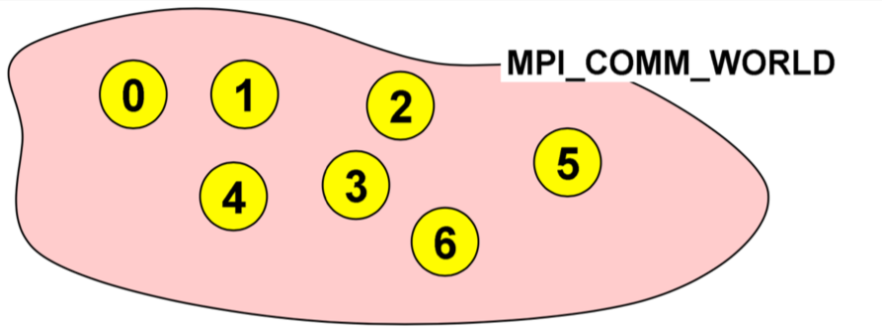

Communicator in MPI. (Image courtesy: Rolf Rabenseifner (HLRS))
:::

#### Ranks and Size

As mentioned earlier, we frequently use the `MPI_COMM_WORLD` when we will need to use a communicator. Once we actually initialize the MPI environment, all the processes would then be in the communicator. As we can predict, it would be nice to be able to distinguish between different processes and this is where the *ranks* come in. When we initialize the environment, the MPI communicator will dedicate a number to each process. This is known as the `rank`. It is a number that is starting from zero and ends with the size minus one. In this example, as you can see, we have launched the application with seven cores and each of them is given a rank. So, in this application we have different processes that have been given ranks from zero to six.

This helps us in identifying and using a specific processor. For instance, if we would want the processor number two to perform a certain task, we can command execution of the task with the condition: if the rank is `2`. In the following subsections, when we progress further to learn about sending messages between specific processors, we will see how rank is useful. It is useful to say, e.g., if rank is equal to `2`, send a message to rank `6`. This is how we do the sending and receiving of the messages between different processes in MPI.

In order to actually get these numbers, we have two basic routines in MPI. We know now that when we initialize the MPI environment, rank is the number that each of the processor is given and is the number by which you can identify a process. The `size`  tells us the number of processes that are contained within a communicator or simply how many processes are in our application. For instance, when the size is 10, rank goes from zero to nine and so on. 

There are two basic routines for the `rank`

~~~c
MPI_Comm_rank(MPI_Comm comm, int *rank)
~~~

and for the `size`

~~~c
MPI_Comm_size(MPI_Comm comm, int *size);
~~~

:::{figure-md}

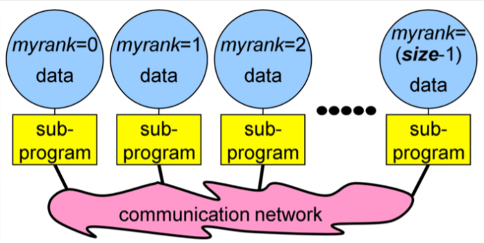

Subprograms in MPI. (Image courtesy: Rolf Rabenseifner (HLRS))
:::
 
### Exercise: Hello World 2.0
In this exercise you will create your first MPI program from the provided skeletons for C, Python and Fortran. 

#### Exercise

Go to the exercise and modify the "Hello world" skeleton so that

1. every process writes its rank and the size of `MPI_COMM_WORLD`

2. only process ranked `0` in `MPI_COMM_WORLD` prints "hello world".

Now run the program with 4 processes. 

Is it possible for the output of all MPI processes to be in the sequence of the ranks? Or is there no chance to guarantee this?

What do you observe when you run the program multiple times? Tell us your answer and thoughts in the comments.

### Messages and communications

Until now, we have introduced the MPI and we have used some simple routines such as rank and size to distinguish between different processes and to actually assign them some numbers that we can recognise and use later. But so far we haven't done anything useful with this knowledge, i.e., we haven't sent any information between the processes. This is where we need to gain an understanding of messages in MPI. 

When we are developing different advanced applications, at some point we will need to exchange information from one process to another. Usually, this information could be some integer, some other values or even arrays etc. This is where messages are used. Messages are packets of data moving between sub-programs. So, as previously described, if we pack the information to be shared between processes into some message, we can send them over the communication network so the other processes can receive them as a message. This is how the data and information is shared between the processes. And of course there is some important information that we will always need to specify in order for the messages to be sent and received efficiently.

:::{figure-md}

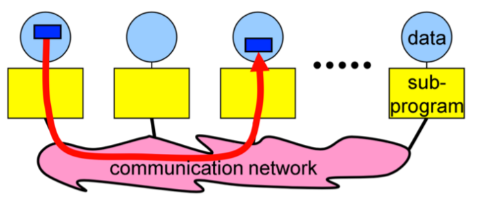

MPI messages. (Image courtesy: Rolf Rabenseifner (HLRS))
:::

As we can see in this example, we are trying to send a message from a process with rank `0` to process with rank `2`. And in order for this to work, we have to specify some information. 
 
- Data size and type

The sender needs to specify what kind of data is being sent. So for example, if we are sending an array of, lets say 100 numbers, we need to specify that the size equals 100. And as you probably already guessed, we would also need to mention what is the type of the data. So, whether it is a character? Is it a double integer? And so on. 

- Pointer to sent or received data

For this data exchange we would need two pointers. These pointers are from the sender that will need to point to its own memory to mention, OK, the data I'm trying to send is here. And then the receiver will need to specify the memory where it would like to receive this data. 

- Sending process and receiving process, i.e., the *ranks*

The MPI environment will need to know who is the sender and who is the receiver. This is where the **ranks come in**. So, for our previous example we would specify that the rank `0` is the sender and the rank `2` is the receiver. 

- Tag of the message

The next information we will need to specify is the `tag` of the message. A tag is a simple number that we can assign any value from which a receiver can identify the message. For instance, if we would send two messages we can assign one tag as, let's say `0` and the other one as tag `1`. This helps the receiver identify and differentiate between messages. But usually if we will have only one message, we can just put the tag as `0`.

- The communicator, i.e., `MPI_COMM_WORLD`

The last argument we will need to specify is what the communicator in which we are sending the messages is. In our case here, it would be the `MPI_COMM_WORLD`, but we would eventually learn better about the functions as we will do more exercises and hands on practice.

#### MPI Datatypes

The MPI environment defines its own basic data types. However, if you're familiar with C they're really simple because what you have to do is just put MPI in capital letters before the variable and change everything to capital case. 

| C Datatype | MPI Datatype |
| :--------------: | :--------------: |
| char | MPI_CHAR |
| int | MPI_INT |
| long | MPI_LONG |
| float | MPI_FLOAT |
| double | MPI_DOUBLE |

So simply put, if you're trying to send an integer, then the type is

~~~c
MPI_INT
~~~

However, as we will get more involved with MPI, we will explore that there is also a way for the user to define its own derived data type. For instance, if we're using `struct` in C, then we can define that struct as a new MPI data type. This proves to be very useful because we can just send everything in one message. So, this would not require us to send portions of the struct with different messages. But we will dwell deeper into the derived data types in the coming Chapters. For this section we're only using simple data types.

### Quiz on MPI basics

We just covered the basics of MPI, communicators and messages. This quiz tests your knowledge of MPI basics and terminology. 

#### Question 1
Which is the predefined communicator that can be used to exchange a message from process rank 2 to process rank 4?
 
* `MPI_COMM_DEFAULT`
* `MPI_COMM_SELF`
* `MPI_COMM_WORLD`
* `MPI_COMM_NULL`

#### Question 2
What does `MPI_Comm_rank()` return?

* Number of processes in an MPI program
* Priority of the current process
* Numerical identifier of the current process within the MPI communicator
* Linux process ID

#### Question 3
What purpose does a communicator serve?

* It prevents your main program’s MPI calls from being confused with a library’s MPI calls
* It can be used to identify a subgroup of processes that will participate in message passing
* If equal to `MPI_COMM_WORLD`, it shows that the communication involves all processes
* All of the above

#### Question 4
A rank number from 0 to N-1 is assigned to each process in an MPI process group, and the higher rank processes are given higher resource priority.

* True
* False

#### Question 5
Which of the following is not required for a message passing call:

* The starting memory address of your message
* Message type
* Size of the message in number of bytes
* Number of elements of data in the message

#### Question 6
What does the parameter tag mean in a message passing call:

* The message type of the incoming message
* Type of communication method
* A user-assigned number that must match on both sender and receiver
* The type of the process group

## Advanced Collective operations

### Different types of communication in MPI

There are two criteria by which we can divide the types of communication in MPI.

First way to define types of communication is to divide it according to the number of processes that are involved. So, if there are only two processes involved in the communication, meaning only one sender and one receiver, then it is referred to as point to point communication. This is the simplest form of message passing where one process sends a message to another. The other type of communication in this category is the collective communication in which we have multiple processes that are involved. This implicates communication between either one processes with many other processes or even many processes communicating with several other processes. So, there are different ways that this can be executed. This is one criteria for distinguishing the types of communication, i.e., distinction by the number of processes involved.

The second criteria and perhaps more complex is by defining the type of communication into blocking and non blocking types. A blocking routine returns only when the operation has completed. This means blocking implies that if we send a message, we can't proceed to the next steps until the receiver actually returns us information that it has received the message.

:::{figure-md}

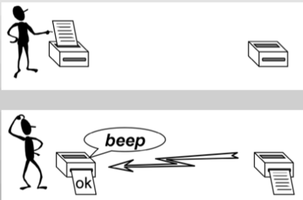

Blocking communication. (Image courtesy: Rolf Rabenseifner (HLRS))
:::

The non blocking communication is more complicated than the simpler blocking counterpart. In this case it returns immediately and allows the sub-program to perform other work. It differs from the blocking communication in a way that if we send something to the receiver, we can execute some other tasks in between and after some time, we can check if the receiver has actually returned the information, i.e., it has received the message, or everything is OK. Many real applications usually employ this type of communication. 

:::{figure-md}

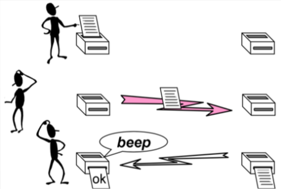

Non-blocking communication. (Image courtesy: Rolf Rabenseifner (HLRS))
:::

#### Point-to-Point Communication

As we already saw in the previous section, Point-to-Point Communication is the simplest communication as it involves only two processes. One of the processes acts as a sender and the other one as the receiver. Here, the source or the sender sends a message via the communicator to the receiver. In order to do so, the environment has to know who is the sender and who is the receiver and this is taken care of by specifying the *ranks* of the processes.

:::{figure-md}

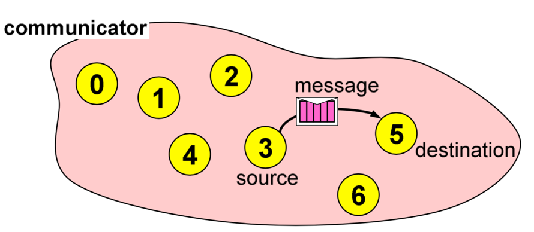

Point to point communication. (Image courtesy: Rolf Rabenseifner (HLRS))
:::

#### Sending paradigms

In order to send a message with Point-to-Point Communication, we use the function

~~~c
MPI_Send(void *buf, int count, MPI_Datatype datatype, int dest, int tag, MPI_Comm comm);
~~~

We will now see what arguments this routine actually needs. 
 
- `buf` is the pointer to the data with `count` elements and each of them is described with datatype. So first of all, we have to specify the address of the data that we would like to send. It's a pointer to the data of the sender and then the second argument is actually the number of elements we send. For example, if we just send 1 integer, the size will be 1. If you send an array with 100 integers, this will be 100 and so on. The third argument this function would like to have is the `datatype`. So, if we are sending an integer, we will have to specify here `MPI_INT` and so on. 

- `dest` is the rank of the destination process. In this argument we specify the rank of the receiver. So, for instance, in the previous example, this will be `5`.

- `tag` is an additional integer information sent with the message. `tag` is basically a number by which we identify the message. So, usually if we just send only one message, we can just put the `0` tag there or maybe any number that we would like. 

- The last argument is the communicator and as we already discussed we usually use `MPI_COMM_WORLD`.

These are the arguments that are the most important information the MPI environment needs in order to know what data is sent and to whom.

#### Receiving paradigms

As we saw the sender needs a function to send a message and obviously the receiver has to call the receive function. This means that for the communication to work, we need two processes and two ranks. So, one will call the `MPI_Send` function and the other will similarly call `MPI_Recv` to receive. To be able to receive, we use the function

~~~c
MPI_Recv(void *buf, int count, MPI_Datatype datatype, int source, int tag, MPI_Comm comm, MPI_Status *status);
~~~

The arguments needed by this function are similar to the `MPI_Send` function.

- The `buf/count/datatype` describe the received data. In the first argument we specify the address of the data, i.e., the address where we would like to receive the data and similarly, we put the data type here.

- `source` is the rank of the sender process. We have to have the rank of the sender process. In the previous example we would specify number `3`, because the rank with number three is trying to send us a message.

- Similar to `MPI_Send`, we also have a `tag` here. It is really important to make sure that we match this number with the sender. So, if the sender specifies that the message has tag `0`, the receiver also has to specify the same number here. Otherwise, this will be an infinite loop as we will not receive anything because we would not match our receive function call with the send function call. 

- The next argument is the communicator and again we would just use the `MPI_COMM_WORLD`.

- The last argument is not so important for us at the moment as this is something that we will be learning in the next exercise. For now we will just use

~~~c
MPI_STATUS_IGNORE
~~~

We will learn more about this status structure in the coming Chapters.

So, let's go through an example to understand again the prerequisites for this communication to work efficiently and how this would actually work in a code.

:::{figure-md}

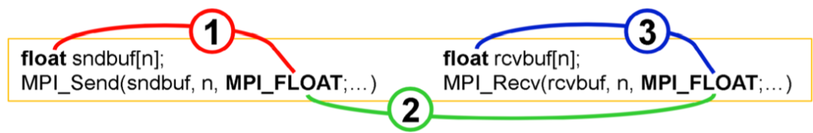

Example. (Image courtesy: Rolf Rabenseifner (HLRS))
:::

Here, the left is the sender and the right is the receiver. Let's suppose that the sender would like to send this buffer array that has `n` floats over to some other process. For this, it calls the `MPI_Send` routine function. As we already know, the first one is the pointer to the data. So, this is the send buffer. Then it needs to specify the `number` of data. In this case, it is `n`. The next argument is `MPI_FLOAT`, and we need to make sure that this data matches with the one mentioned earlier. As we previously discussed, this is the MPI data type that the environment defines, but it has to match with this one, otherwise the communication will not work. Another thing we need to keep in mind is that this data type has to match with the receiver. So, we have to be careful when we write these functions that all of these have to match. Now, the receiver has to call the receiver function with the same data type. Here it has to first define an array where it would like to receive this data, the receive buffer. The communicator, of course, has to be the same because they are bound in the same program. But we usually use the `MPI_COMM_WORLD` communicator. The next important part is that the `tag` has to match. And finally, the type of the message or type of the data has to match.

### Exercise: Send and receive

In this exercise you will write a basic MPI program which uses `MPI_Send` and `MPI_Recv` routines to send the number `-1` from process `0` to process `1` (ping).

#### Hint
~~~c
if (rank == 0) { ... }
else if (rank == 1) { ... }
~~~

#### Expected output

> >      I am 0 before send ping
> >      I am 1 after recv ping

#### Possible, but unexpected output

> >      I am 1 after recv ping
> >      I am 0 before send ping

### Exercise: Ping pong

In this exercise you will get to practice using `MPI_Send` and `MPI_Recv` routines. 

This is a continuation of the previous exercise when we send one ping from process `0` to process `1`. Now you will send and receive multiple messages. 

#### Exercise

Two processes ping pong a token back and forth, incrementing it until it reaches a given value.

1. Process `0` sends a message to process `1` (ping).

2. After receiving this message, process `1` sends a message back to process `0` (pong).

3. Each time a message is sent, the token is incremented by `1`.

4. Repeat this ping pong until the value of token reaches `6`, i.e., 3 pings and 3 pongs.

#### Sequence of the output that reads well

> >      I am 0 before send ping
> >      I am 1 after recv ping
> >      I am 1 before send pong
> >      I am 0 after recv pong

#### Sequence of the output that reads badly

> >      I am 0 before send ping 
> >      I am 0 after recv pong 
> >      I am 1 after recv ping 
> >      I am 1 before send pong

### What happens with a different number of pings and pongs?

Does the program in the previous step work for different number of pings and pongs, i.e., 3 pings and 2 pongs?

### Exercise: Rotating information around a ring

In this exercise you will get to experiment with blocking and non-blocking communication. With the use of non-blocking communications we want to avoid idle time, deadlocks and serializations. This is the first part of a two part exercise. 

This is a small example of ring communications, which is a halo communication with cyclic boundary conditions. Each process is sending its data to its right neighbour and receiving the data from its left neighbour (in a ring). If we use blocking routines, there is a risk of deadlocks and serializations. All processes can be stuck at `MPI_Send` because they are waiting for the `MPI_Recv` to be called. 

You are starting with the provided source code which is wrong because it uses `MPI_Send` and `MPI_Recv` in a naive way. If `MPI_Send` is implemented with a synchronous communication protocol then this program will deadlock. But we are expecting this wrong program to work because we are sending only a small 1 integer message instead of huge double precision arrays. The below program sends the rank values around the ring in a loop with process iterations and sums up all the values that are coming along (sum of all ranks). The calculation of the neighbour ranks is done with the modulo operation. We use 2 different buffers for send and receive, which is normally used when we are doing non-blocking communication.

~~~c
#include <stdio.h>
#include <mpi.h>

int main()
{
    int rank, size;
    int snd_buf, rcv_buf;
    int right, left;
    int sum, i;
    MPI_Status status;

    MPI_Init(NULL, NULL);
    MPI_Comm_rank(MPI_COMM_WORLD, &rank);
    MPI_Comm_size(MPI_COMM_WORLD, &size);

    right = (rank+1)      % size;
    left  = (rank-1+size) % size;

    sum = 0;
    snd_buf = rank; //store rank value in send buffer
    for(i = 0; i < size; i++) 
    {
        MPI_Send(&snd_buf, 1, MPI_INT, right, 17, MPI_COMM_WORLD); //send data to the right neighbour
        MPI_Recv(&rcv_buf, 1, MPI_INT, left,  17, MPI_COMM_WORLD, &status); //receive data from the left neighbour
        snd_buf = rcv_buf; //prepare send buffer for next iteration
        sum += rcv_buf; //sum of all received values
    }
    printf ("PE%i:\tSum = %i\n", rank, sum);

    MPI_Finalize();
}
~~~

#### Exercise

1. Go to the exercise and run with processes 3, 4, 5 and check for correct sums. 

2. Then substitute `MPI_Send` with `MPI_Ssend` (explicit synchronous send). Run the program. You will see a deadlock and you will need to kill the program.

3. Resolve the deadlock with a serialization. Use the trick: `if rank == `, then do first receive and then send, for example. Run the program with 3, 4, 5 processes to see, if you have resolved the deadlock. Now run the program with 1 process. It will still deadlock. The program is still wrong due to bad performance and it will still deadlock when running with only 1 process. 

* Why did we use a program with 2 different buffers instead of 1 for the serialization solution?

* Why does the serialized solution still deadlock when running with 1 process?

### Dynamic Receiving with MPI PROBE and MPI STATUS

In the previous exercise we implemented the program where we were sending an array along the ring. This was an example of an application in which we already knew that we would be using an array with 100 values. We were already aware of how long it is going to be or in other words how big that message is going to be, how many elements are actually sent and so on. 
This was important because if we look back into the send and receive routines, we need to specify this `count`. So, not knowing these numbers already accounts as a problem. In this subsection we will learn that there are two ways to handle this situation, i.e., if the size of the message is not known.

- The first way is to send the size of the data as a separate send/recv operation. Therefore, we would send a separate message with `MPI_Send` where we can send for example the number of elements in an array that we're going to send out later. This works, but sometimes it's not very efficient. 

- The second and a more efficient way is what we will learn in this subsection with the help of two functions. We will solve this by using `MPI_Probe` and `MPI_Status` to obtain the size of sent data.

In order to learn more about these functions and how to use them we need to grasp some concepts that follow.

#### Wildcards

Until now, when we have been calling the `MPI_Send` and `MPI_Recv` functions, we have been specifying some information. In these cases the receiver can use *wildcards* in some of those arguments. This means in the function

~~~c
MPI_Recv(void *buf, int count, MPI_Datatype datatype, int source,int tag, MPI_Comm comm, MPI_Status *status);
~~~

the receiver can just put the source as

~~~c
MPI_ANY_SOURCE
~~~

and this would imply that it doesn't care from where the message will come allowing to receive from any source. For example, if you all would send me a message and I would just like to read one of the messages I would use this. So, I wouldn't care who was sending me the information and I would just read it from one of the sources. 
Similarly, we can do this to the `tag`. In the function where we have to mention the `number` of the tag we can just use

~~~c
MPI_ANY_TAG
~~~

allowing us to receive a message having any tag. 

### `MPI_Status` and `MPI_Probe`

`MPI_Status` is a struct that contains important information such as the following:

- The rank of the sender as 

~~~c
status.MPI_SOURCE
~~~

- The tag of the message as

~~~c
status.MPI_TAG
~~~
 
- The length of the message with

~~~c
MPI_Get_count(MPI_Status *status, MPI_Datatype datatype, int *count)
~~~

So, this `Status` struct has some attributes that can provide us with additional information about the sender. For instance, like we saw if we use the `MPI_ANY_SOURCE` or `MPI_ANY_TAG`,  then in that case `Status` is the only way of how we can find out who the sender actually was. So, using the first two we can get the information about who is the sender and the tag of the message. We will also see later in an exercise that we can use the `Status` struct to call the function `MPI_Get_count` that actually gives us the size of the message. So, if we don't know how many `numbers` or if we don't how large the message is going to be, we can use the `MPI_Get_count` function to deduce what was the size of the message. We will soon see how this works in an example. 

`MPI_Probe` is a function that is used to probe for an incoming message before actually receiving it. This function is similar to the receive function, but it is much more quicker as it executes without actually receiving the message. So, as the name `MPI_Probe` suggests, it probes for an incoming message. Basically the receiver can check whether there is a message waiting for it. We call it using 

~~~c
MPI_Probe(int source, int tag, MPI_Comm comm, MPI_Status* status);
~~~

It can be thought of as an `MPI_Recv` that does everything but receive the message, yet we can get a lot of information out of it. Once we have that information, we can actually use `MPI_Recv` to receive the actual message. 

We can understand these functions better by the following optional exercise.

### Quiz: Do you understand point-to-point communication?

This quiz covers various aspects of point-to-point communication that have been discussed so far this Chapter.

#### Question 1
You must specify the rank for both source and destination processes, when sending a message using `MPI_Send`:
 
* True
* False

#### Question 2
In the following function call, a message is sent to which process?

~~~c
MPI_Send(message, 4, MPI_CHAR, 5, tag, MPI_COMM_WORLD)
~~~
 
* Process 4
* Process 5

#### Question 3
If you call `MPI_Recv` and there is no incoming message, what happens?

* the Recv fails with an error
* the Recv reports that there is no incoming message
* the Recv waits until a message arrives (potentially waiting forever)
* the Recv times out after some system-specified delay

#### Question 4
The MPI receive routine has a parameter `count` – what does this mean?

* The size of the incoming message (in bytes)
* The size of the incoming message (in items, e.g. integers)
* The size you have reserved dor storing the message (in bytes)
* The size you have reserved for storing the message (in items, e.g. integers)

#### Question 5
What happens if the incoming message is larger than `count`?

* The receive fails with an error
* The receive reports zero data received
* The message writes beyond the end of the available storage
* Only the first `count` items are received

#### Question 6
What happens if the incoming message (of size `n`) is smaller than `count`?

* The receive fails with an error
* The receive reports zero data received
* Only the first `count` items are received

#### Question 7
You want to send a buffer that is an array buf with 5 double precision values. How do you describe your message in the call to `MPI_Send` in C and Fortran? (fill in the blank lines)

in C: `buf, __, MPI_ __`

in Fortran: `buf, __, MPI_ __`

#### Question 8
You want to receive a buffer that is an array buf with 5 double precision values. When calling `MPI_Recv` to receive this message which count values would be correct? (multiple choice answer)

* 1
* 2
* 5
* 6

#### Question 9
When using one of the MPI send routines, how many messages do you send?

* 1
* 2
* 4

#### Question 10
How is the actual size of the incoming message reported?

* The value of `count` in the receive is updated
* MPI cannot tell you
* It is stored in the Status parameter
* With the associated tag

## Collective communications

### Basic collective communications

So far all the different methods we learnt and exercises we practiced actually only involved point to point communication, communication between two processes. Now we will introduce some more advanced communication in which more processes are involved. We have to keep in mind that in these communications involving a group of processes, the routines are called by all processes in a communicator. So, simply put all the processes that are involved in this communication need to call the same routine. 

Examples of these types of communication are 

- Broadcast
- Scatter
- Gather
- Reduction

#### Broadcast

Broadcast is the simplest one of all the forms of collective communication and it is used to send out user input or parameters to all processes. The essential idea of the broadcast is that we select one process to send the same data to all other processes in the communicator. Usually we use broadcast at the beginning of the algorithm in cases where we would like to distribute the user input or some parameters of the algorithm. For instance, if we don't use parallel IO (input-output), the usual case is that we read a file with one processor and then we distribute the contents with the broadcast.

To execute this we will be using the function 

~~~c
MPI_Bcast(void* data, int count, MPI_Datatype datatype, int root, MPI_Comm communicator);
~~~
 
Similar to most functions we have learnt so far, in the arguments of the broadcast function we would like to specify the data, so the pointer of the data we would like to share. Again, we specify how 'many' of data there is and what is its type. However, an interesting difference we will notice here is that there is no sender source or receiver. But actually what this 'root' tells us is that here we specify the rank of the process that distributes the data. All other processes that are not the root receive the message. Although the root process and receiver processes do different jobs, they all call the same MPI_Bcast function! We will understand it better through example. At the end of the arguments we have to specify the communicator.

For example, suppose we have initialized the MPI application with five processors, which implies ranks zero to four. Now we would like the rank '1' to send a string, a character array that contains the letters 'r-e-d' to all other processes. As mentioned already in order for this to work, the rank '1', as well as all other processes that we would like to be involved in this communication have to call the same function and the prototype of this function.

:::{figure-md}

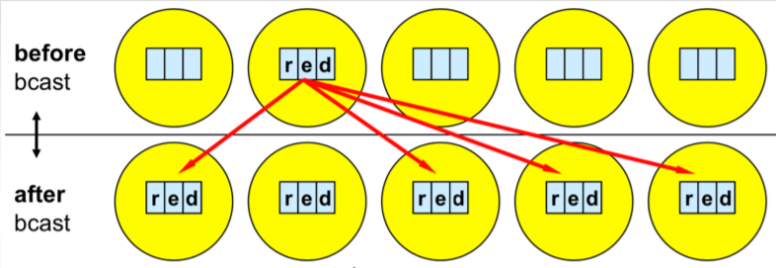

Broadcast communication. (Image courtesy: Rolf Rabenseifner (HLRS))
:::

So, here suppose `red` is contained in the array called `buf`. There are three elements we would like to distribute among all other processes. Their data type is character, so we use `MPI_CHAR`. The root is `1`, so the process that is sending or broadcasting the data has rank `1`, followed by the communicator `MPI_COMM_WORLD`. So, the function for the image above would be

~~~c
MPI_Bcast(buf, 3, MPI_CHAR, 1, MPI_COMM_WORLD);
~~~

We can see that it's a pretty simple but very useful routine. Remember only that this exact function call has to be called by every process involved, the root and all of the receiving processes.

### Exercise: Broadcast

In this exercise you will get to use `MPI_Bcast` and write your own broadcast function. You will compare the time efficiency of the MPI and your function. 

#### Exercise

1\. Go to the exercise and complete the program that uses `MPI_Bcast` routine to broadcast an array with 10.000.000 numbers from process with rank 0. 

2\. Write your own broadcast function using `MPI_Send` and `MPI_Recv` routines. 

~~~c
void my_Bcast(void* data, int count, MPI_Datatype datatype, int root, MPI_Comm communicator);
~~~

3\. Measure the time of both routines using the MPI function `MPI_Wtime` when running with 2, 4, 8 processors. What do you make of the differences at different scales?

~~~c
double MPI_Wtime(void);
~~~

### What do you observe with broadcast communication?

In the previous exercise you ran a program using the `MPI broadcast` routine and writing your own `my_Bcast` function. What did you observe executing the program and comparing the executing times? Are the times for your program and the one from the library the same?

With the help of the following image you can see the difference between the two algorithms. 

:::{figure-md}

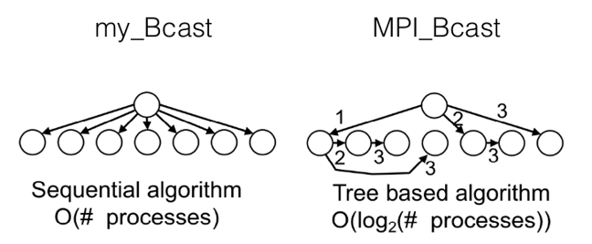

Comparison of two broadcast algorithms. 
:::

### Scatter and gather

#### Scatter

As we saw in the broadcast function, the root process sends the same data to every other process. However, sometimes in many applications, we might have some data, that we would like, as the word says, to *scatter* among other processes. This denotes that we need to divide the data into equal parts so each process has the equal part to receive, meaning each process in our communicator will just get a fraction of it. So, this is the main difference between scatter and broadcast. We will see through the exercises further on where this would be useful.  

This is the function prototype

~~~c
MPI_Scatter (void *sendbuf, int sendcount, MPI_Datatype sendtype, void *recvbuf, int recvcount, MPI_Dataype recvtype, int root, MPI_Comm comm)
~~~

The function prototype is similar to broadcast, but we will go through the arguments because there are some parts we need to be careful with. As usual first we have to specify the data, so this is the buffer. In this example, the root processor will be the one with rank `1` that would like to scatter this array of five *numbers* to all the other processes. To be able to do this, it will need to specify this `sendbuf`. Following that is the number `sendcount` and a bit later we will see a `recvcount`. Usually, they are the same. This is actually the number that tells you how many elements will be sent to each process and it is important to note that it does not mean how many elements are sent in total, but only the fraction that each process will get. The next argument is the `recvbuf`, that is the buffer of the the process that will receive the data. Finally, `root` is the same as in broadcast. It is the process that actually does the scattering and `comm` indicates the communicator in which the processes reside. The only thing we need to be careful with in this function is the `sendcount` and `recvcount` because this is the number that dictates how many elements will be sent to each process and not the number of whole elements. Another important thing to be noted is that when this function is finished, the sender (in our example the process with rank `1`) will not get the information of the whole data. In our example, this would mean that after communication rank `1` will have only a part of the data, i.e., `B`.

:::{figure-md}

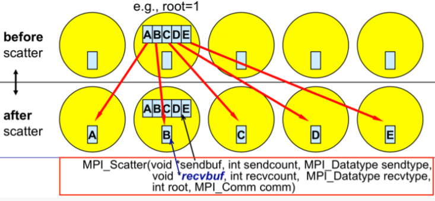

Scatter function. (Image courtesy: Rolf Rabenseifner (HLRS))
:::

The difference between `MPI_Bcast` and `MPI_Scatter` is that while `MPI_Bcast` sends the same piece of data to all processes whereas `MPI_Scatter` sends chunks of data to different processes. 

#### Gather

After the data or the information is scattered, quite obviously, the information would need to be, as this function suggests, *gathered*. Gather is the inverse of Scatter. The gather function quite literally gathers all the information back to the original root process. As we will see the basic idea in many MPI applications is that we have some data, we scatter it, so that every process computes something and then we gather back the information together in one process. The function is quite similar to `MPI_Scatter`

~~~c
MPI_Gather(void *sendbuf, int sendcount, MPI_Datatype sendtype, void *recvbuf, int recvcount, MPI_Dataype recvtype, int root, MPI_Comm comm)
~~~

The main difference here is that since only one process, i.e., the root gathers all the information it is the only one that needs to have a valid receive buffer. All other calling processes can pass `NULL`  for `recvbuf` since they do not receive anything as they just send the data to the root process. Finally, once again to be noted and remembered is  that the `recvcount` parameter is the count of elements received per process and not the total summation of counts from all processes!

:::{figure-md}

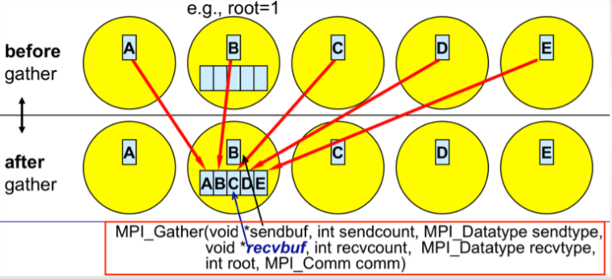

Gather function. (Image courtesy: Rolf Rabenseifner (HLRS))
:::

### Exercise: Scatter and Gather

In this exercise you will write an MPI program that computes the average of an array of elements using `MPI_Scatter` and `MPI_Gather`.

This quite simple program demonstrates how one can use MPI to divide work across processes, perform computation on subsets of data and then combine the smaller results into the final result. 

The program takes the following steps:

1. The root process (process `0`) creates an array of generated random numbers. 

2. Scatter the random numbers from the root process to all other processes, giving each process an equal amount of numbers.

3. Each process computes the average of their subset of numbers.

4. The root process gathers each individual average and computes the total average on now a much smaller array of numbers. 

#### Exercise

First, think about how would you solve this exercise without `MPI_Scatter` and `MPI_Gather` routines. 

* Go to the exercise and look at the provided skeleton. Use `MPI_Scatter` and `MPI_Gather` routines and compute the missing final average result to solve the exercise. 

## Advanced Collective operations

### MPI_Reduce

So far in the *basic collective communication* we have encountered broadcast, scatter and gather. Now, we can move on to more *advanced collective communication* where we will cover routines `MPI_Reduce` and `MPI_Allreduce`. 

Before we go into these routines, let's revise the concepts of *reduce* or data reduction in practice. Simply put, data reduction involves reducing a set of numbers into a smaller set of numbers via some function. For example, let’s say we have a list of numbers (1, 2, 3, 4, 5). Then reducing this list of numbers with the sum function would produce:

    sum(1, 2, 3, 4, 5) = 15

Similarly, if we would use another function say, multiply, the multiplication reduction would yield

    multiply(1, 2, 3, 4, 5) = 120.

Quite simply, this is what an MPI reduction function does. 

#### `MPI_Reduce`

`MPI_Reduce` is basically what we did in the last exercise with an additional functionality. In a way what the reduce routine does is basically similar to scatter/gather, but we also specify an MPI function like sum, multiplication, maximum or something similar. We will see later on, which functions are available and how we can use them. So, the MPI library uses those functions directly on this data that gives us the reduced result immediately. We don't have to call the gather routine and then manually program to get the sum, but instead the library does it for us. Therefore, `MPI_Reduce` takes an array of input elements on each process and returns an array of output elements to the root process. The output elements contain the reduced result.

Perhaps it would be easier to understand it through an example.

:::{figure-md}

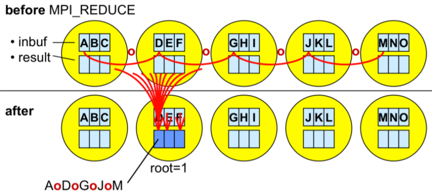

Reduce function. (Image courtesy: Rolf Rabenseifner (HLRS))
:::

Let's assume that we're trying to compute a sum, but different numbers are scattered across different processes. If we would have our numbers (1, 2, 3, 4, 5) we would call `MPI_Reduce` on this data and we will also need to mention the function that we would like to reduce the data, e.g., the sum. Then the root process will get the sum as a result. To be able to do this we would need the prototype of the `MPI_Reduce`

~~~c
MPI_Reduce(void* send_data, void* recv_data, int count, MPI_Datatype datatype, MPI_Op op, int root, MPI_Comm communicator);
~~~

The arguments of this routine are pretty similar to the ones we have seen so far. 
So, the `send_data` parameter is an array of elements that each process wants to reduce. Following that is the `recv_data` that is only relevant on the process with a rank of root as it contains the reduced result. Then we mention the `count`, i.e., the number or quantity of the data and the datatype. However, this is where the `MPI_Reduce` function is different. Here we also mention the *operation* in the op parameter, i.e., the operation that we wish to apply to our data. The list of reduction operations in the MPI library is as follows: 

| Function | `MPI_Op` |
| :--------------: | :--------------: |
| Maximum | `MPI_MAX` |
| Minimum | `MPI_MIN` |
| Sum | `MPI_SUM` |
| Product | `MPI_PROD` |
| Logical AND | `MPI_LAND` |
| Logical OR | `MPI_LOR` |

### Exercise: Computing average with MPI_Reduce

In this exercise you will write an MPI program that computes the average of an array of elements using `MPI_Reduce`. 

In the previous lesson, you computed the average using `MPI_Scatter` and `MPI_Gather`. Using `MPI_Reduce` simplifies the code quite a bit. 

The program takes the following steps:

1. Each process creates an array of generated random numbers. 

2. Each process performs the `local_sum` calculation. 

3. Reduce the `local_sum` to the root process (process `0`) using `MPI_SUM`. 

4. The root process calculates the final average. 

#### Exercise

* Go to the exercise and rewrite the program using `MPI_Reduce` to compute a global average.

### Exercise: Calculate Pi!

In this exercise you will get to practice using both broadcast and reduce MPI routines. 

This exercise is a simple program to calculate the value of Pi derived from integral by approximation using Riemann sum. Here is a reminder that we are evaluating this integral

$\pi = \int_{0}^1 \frac{4}{1+x^2}~dx$

and can be approximated numerically using Riemann sum:

$\pi \approx \sum_{i=0}^{n-1}f(x_i+h/2)h$

#### Exercise

1. Root process (process `0`) asks the user for the number of integral intervals (for interactive notebooks we have hardcoded this number) and then broadcasts this number to all of the other processes. 

2. Each process then locally adds up every n-th interval. 

3. Finally, the sums computed are added together using reduction.

### MPI_Allreduce

In the `MPI_Reduce` function that we learnt previously, the idea was that one of the processors will take data from different processors to combine them using some MPI operation, use this operation to reduce the data and get the results. The `MPI_Allreduce` stands out from the `MPI_Reduce` in a peculiar way: in *Allreduce* all of the processes get this result. To understand it simply, we reduce the data and somehow broadcast the result at the same time. Of course, it is possible of doing this ourself but with `MPI_Allreduce` the library does it making it not only faster but also easier for us. 

Many parallel applications require accessing the reduced results across all processes rather than only the root process. This is where `MPI_Allreduce` is mostly used as it reduces the values and distributes the results to all processes. Simply put, *Allreduce* is basically the *reduce* and the *broadcast* function combined. The prototype for `MPI_Allreduce` is quite similar to the `MPI_Reduce` and it looks like

~~~c
MPI_Allreduce(void* send_data, void* recv_data, int count, MPI_Datatype datatype, MPI_Op op, MPI_Comm communicator);
~~~

However, a major difference would be that here is no `root` in the argument because all the processes will get the data. Everything else is pretty much the same. We have two pointers for the send and receive data. We have the number of elements sent by each processor followed by the data type. Then similar to the reduce function we have the MPI operation that we want to use to reduce the data and of course finally the communicator. 

Since we are already familiar with the reduce function it would be easier for us to learn about the *Allreduce* through the following exercise.

### Exercise: Computing standard deviation

In this exercise you will write an MPI program that computes the standard deviation of an array of numbers in parallel using `MPI_Reduce` and `MPI_Allreduce`. 

Standard deviation is a measure of the dispersion of numbers from their mean. A lower standard deviation indicates that the values are closer together (close to the mean), while a high standard deviation indicates that the values are spread out over a wider range.

$\sigma = \sqrt{ \frac{\sum |x-\bar{x}|^2}{n}  }$

Standard deviation is one of the problems that requires doing multiple reductions. First you must compute the average of all numbers. After the average, the sums of the squared difference from the mean are computed. The square root of the average of the sums is the final result. After this description, we know there will be at least two sums of all numbers, which means two reductions. 

The program takes the following steps:

1. Each process creates an array of generated random numbers.

2. Each process computes the `local_sum` and sums them using `MPI_Allreduce`. 

3. After the `global_sum` is available on all processes, each process computes the `mean` so that `local_sq_diff` can be computed. 

4. Reduce the `local_sq_diff` to the root process (process `0`). 

5. The root process calculates the standard deviation by taking the square root of the mean of the global squared differences. 

#### Exercise

Go to the exercise and rewrite the program using `MPI_Reduce` and `MPI_Allreduce` to compute the standard deviation. 

#### Note
We are using `rand()` to generate random numbers which are uniformly distributed on interval [a,b] (in our case [0,1]). Hence, we know that `mean = (a+b)/2 = 1/2` and `stddev = (a+b)/sqrt(12) = 1/sqrt(12) = 0.2887`.

### Quiz: Do you understand collective communication?

This quiz covers various aspects of collective communication that have been discussed this Chapter.

#### Question 1
Which are the major rules when using collective communication routines and do not apply to point-to-point communication?

Choose the one true statement.

* Only the sending process must call this routine.
* The destination provess of a communicator must call this routine.
* All processes of a communicator must call this routine.

#### Question 2
Which are the major rules when using collective communication routines and do not apply to point-to-point communication?

Choose the one true statement.

* The message size argument on the receive side must be larger than the message size argument on the sender side.
* The message size argument on the receive side must match the message size argument on the sender side. 
* The message size argument on the receive side must be smaller than the message size argument on the sender side.

#### Question 3
Which are the major rules when using collective communication routines and do not apply to point-to-point communication?

Choose the one true statement.

* Nonblocking collectives match with blocking collectives.
* Nonblocking collectives do not match with blocking collectives.

#### Question 4
Which operation may be though of as the ‘inverse’ of the MPI_SCATTER function?

* `MPI_GATHER`
* `MPI_RECV`
* `MPI_BROADCAST`
* `MPI_REDUCE`

#### Question 5
Some MPI collective calls specify both a send type and a receive type, e.g. `MPI_Scatter(sendbuf, sendcount, sendtype, recvbuf, recvcount,  recvtype, …)`. 

However, most times when you see this call used in practice we have sendtype = recvtype. 

Why does MPI make you specify both types?

* So it can check at runtime that you haven't made a silly mistake
* So it can do type conversion if required
* The types and counts can be different provided that at least one of them is an MPI derived type
* The types and counts can be different provided that the two buffers are the same length in bytes

#### Question 6
In a scatter operation, what is the best way to use the sending and receiving buffers:

* It is generally OK for the sendbuf and recvbuf to be the same buffer
* Allocate the senbuf only on the root process and recvbuf on all other processes

#### Question 7
Which collective communication call should be used when simple synchronization across a communicator is required?

* `MPI_REDUCE`
* `MPI_BARRIER`
* `MPI_BROADCAST`

#### Question 8
What is the output of this MPI code on 8 processes, i.e. on running ranks 0, 1, 2, 3, 4, 5, 6 and 7?

~~~c
if (rank % 2 == 0) { //even processes
	MPI_Allreduce(&rank, &evensum, 1, MPI_INT, MPI_SUM, MPI_COMM_WORLD);
	if (rank == 0) printf("evensum = %d\n", evensum);
} else { //odd processes
	MPI_Allreduce(&rank, &oddsum, 1, MPI_INT, MPI_SUM, MPI_COMM_WORLD);
	if (rank == 1) printf("oddsum = %d\n", oddsum);
}
~~~

Options:
* evensum = 16, oddsum = 12
* evensum = 28, oddsum = 28
* evensum = 12, oddsum = 16
* evensum = 8, oddsum = 7

### Chapter 3 wrap-up

In Chapter 3 we presented the concepts, programming and execution model of MPI in detail. As with OpenMP in the previous Chapter, the hands on examples served to show how to use this paradigm as efficiently as possible.

Please, discuss the MPI parallel programming paradigm and try to summarize its potential in general or maybe specifically for your applications.
